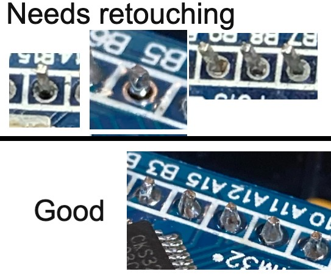
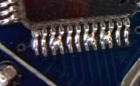
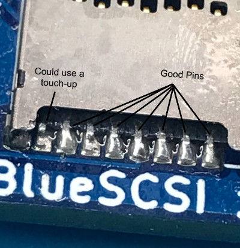
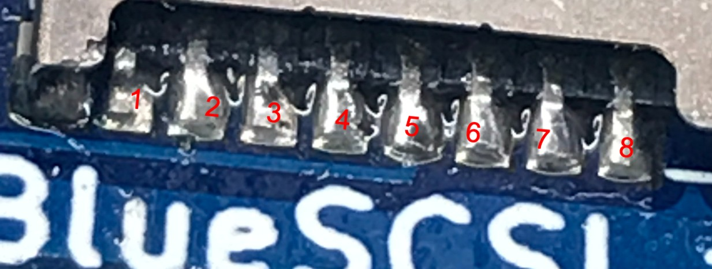

# Troubleshooting - Kit

## General:

  * Do not adjust any jumpers on the BluePill microcontroller itself(the 2 near the USB port).  Those are used for programming the device and can potentially erase the memory

  * Double check solder connections.  Ensure no solder bridges, cold or broken solder joints, bad solder connections, etc.  If in doubt, can’t hurt to touch it up.

  * Make sure Resistor networks are facing the correct way, and the Bluepill is inserted onto the board with the USB next to the SD.

image::images/orientation.png[]

  * Check the chip on the Bluepill itself, make sure no solder balls or anything(If there are, sometimes you can just knock them off with a small screwdriver or toothpick, sometimes you'll need to use an iron and flux/wick)
  

  * Clean any excess flux on the board,  even if it says no-clean.  Sometimes that can cause issues.  Rubbing alcohol and a toothbrush is usually a good solution.

  * Make sure your termination is set correctly.  If it’s the last device on the SCSI chain, you must have termination enabled by having the 2 jumpers on the BlueSCSI board near the SCSI port and resistor networks.

  * Make sure there are no conflicting SCSI IDs. If possible, remove any other SCSI devices.

  * If you have another computer to try it on, give it a try on there.

## No Power:
Most computers should provide SCSI termination power through the SCSI cable, which is enough to power the Bluepill(Mac Plus is a known exception unless you do a mod), but it’s entirely possible a computer doesn’t for whatever reason.   Unplug the BlueSCSI from the computer’s SCSI Connection and try to power it either through the MicroUSB port on the BluePill, or 5v through the Berg connector.  If it lights up at all, it’s possible you computer doesn’t provide the correct SCSI termination power.  Double check all your solder joints on the BluePill, SCSI connector, and Resistor networks.  If those are good, you can get a cheap Molex to Floppy(Berg) power connector and use it that way.

Also ensure that nothing on the BlueSCSI has been shorted out at all.  Any time you’re working on it make sure any headers from components aren’t resting on a conductive surface.

## PC13 LED flashes 5x
This means the SD card cannot be found

  * Check the connections in the MicroSD Socket.  Make sure they all look covered with solder, no bridges between contacts, etc
  * Make sure that the outside of the shield is properly soldered down

  * With a multimeter in continuity mode, check the following pins on the SD card slot, make sure they contact the pins correct pins on the bluepill.  

|=======================
|SD Socket|BluePill 
|1    |N/C
|2    |A6 
|3    |Gnd
|4    |A5
|5    |3.3V
|6    |A7
|7    |A4
|8    |N/C
|=======================

  * Make sure no 2 pins are shorting against each other. 
  * Make sure all Flux is cleaned off the board, a toothbrush with rubbing alcohol on it tends to work well.
  * SD Cards need to be either ExFAT or Fat32 formatted(ExFAT gives better performance).  They must be using MBR, not GPT or Apple partition scheme.  
  * The tool on https://www.sdcard.org/downloads/formatter/ tends to work well for resolving formatting issues.  Chose the “Overwrite format” option.
  * If you have another SD card, give that a try.

## PC13 continuously flashes
This could be 2 things.  If it’s running an older version of the BlueSCSI software, that means no SD card found or an image can’t be loaded.  Follow the steps in Troubleshooting-Assembled

It could also mean that it’s running the default “blink” program that often comes loaded on BluePills. If you messed with the jumpers on the BluePill itself, make sure they are both set to the 0 position(Closest to the MicroUSB port).  If you purchased the BluePill yourself, make sure you flashed the software using the https://github.com/erichelgeson/BlueSCSI#flashing[flashing procedure].   
If you purchased the kit from an authorized BlueSCSI distributor, it should come pre-flashed with the latest software.  Contact who you bought it from.  

## Further troubleshooting

If the troubleshooting above doesn’t work, or there’s another issue, check the Troubleshooting-Assembled document

You can also join us on Discord and ask in the BlueSCSI-support channel.  It has many contributors of the BlueSCSI project and knowledgable BlueSCSI users
